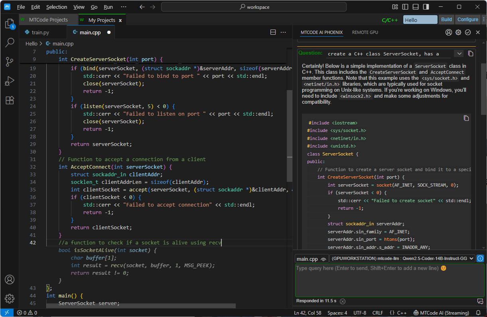

# MTCode AI Phoenix

AI-powered code completion and chat for VS Code — connect to your own LLM server and get intelligent suggestions as you type.

## Quick Start

Visit [mtcodeai.com](https://mtcodeai.com) to download the MTCode Server. The built-in MTCode-LLM server program displays a curated list of high-quality open-source models optimized for coding assistance. Select a model that fits your GPU's VRAM capacity, and the server will automatically download it from Hugging Face and be ready for use.

1. **Set Up an LLM Server** — Install and start an MTCode Server with the MTCode-LLM server program. Load a code-optimized model (e.g., Qwen2.5-Coder or Qwen3-Coder) in GGUF format. The server can run locally or remotely — the MTCode Server Platform handles connectivity so the extension can reach your server from anywhere on the Internet.
2. **Install the Extension** — Install MTCode AI Phoenix from the VS Code marketplace.
3. **Create an Account & Invite Users** — Register an admin account at mtcodeai.com, add your LLM server from the MTCode Server program, then invite users by granting access. The extension has the MTCode Server Portal built in.
4. **Connect** — Open the AI Phoenix sidebar, select your server from the dropdown. The status shows "Server Ready" when connected and the model is compatible.
5. **Start Coding** — Type in any file and AI completions appear automatically. Press `Tab` to accept, `Escape` to dismiss. Use the chat panel to ask questions or generate code.

## Features

### Inline Code Completion

- **Automatic triggering** — suggestions appear as you type with a configurable delay
- **Fill-in-the-Middle (FIM)** — the model sees code before and after your cursor for context-aware predictions
- **Smart caching** — repeated requests at the same location return cached results instantly
- **Quick toggle** — click the check button on the extension title bar to turn completions on or off

**Keyboard shortcuts:**
- `Tab` — accept full suggestion
- `Shift+Tab` — accept first line only
- `Ctrl+Right` — accept first word
- `Escape` — dismiss

### AI Chat

- **Markdown & syntax highlighting** — responses render with formatted code blocks (C, C++, Python, JavaScript, Markdown)
- **Streaming responses** — answers appear word by word in real time
- **Automatic context** — the active editor file is used as context; switch files and context switches automatically
- **Additional context files** — attach extra files for the AI to reference
- **Conversation history** — manage and revisit previous conversations

*AI chat panel on the right with Markdown-formatted responses, and inline code completion shown as gray ghost text at the cursor position in the editor*

### Private, Self-Hosted & Free

Both the extension and the MTCode Server are free of charge. Your code never leaves your network — all data is transmitted directly over an encrypted connection. No cloud subscriptions, no data sharing with third parties.

## Model Compatibility

| Model Family | Status | Notes |
|---|---|---|
| **Qwen2.5-Coder** | Extensively Tested | Recommended. Excellent completion and chat quality. |
| **Qwen3-Coder** | Extensively Tested | Recommended. Latest generation with improved reasoning. |
| **DeepSeek-Coder** | Limited Testing | Functional with positive results. |
| **Other GGUF models** | Varies | Any GGUF model supported by llama.cpp that uses the same prompt template as the Qwen model should work. |

**Tip:** Use a code-specialized model (e.g., Qwen2.5-Coder-14B-Instruct, Qwen2.5-Coder-7B-Instruct, Qwen3-Coder-Next, or Qwen3-Coder-30B-A3B-Instruct) that fits your GPU's VRAM. Larger models produce better results but require more memory and GPU computing power.

## Configuration

Click the gear icon on the extension title bar to open settings.

- **Enable/disable** — turn completions on or off globally or per language
- **Auto trigger** — automatic suggestions as you type, or manual only
- **Max tokens** — tokens per suggestion (roughly 1 token per 4 characters)
- **Context size** — lines of code before and after cursor sent to the model
- **Completion delay** — delay before sending a request to avoid interrupting rapid typing
- **Request timeout** — maximum wait time for a server response
